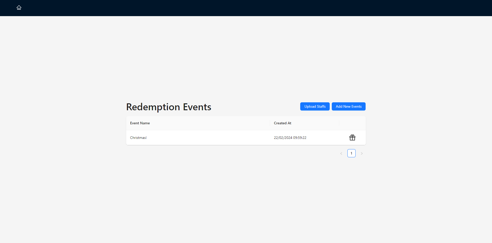
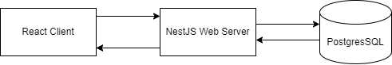
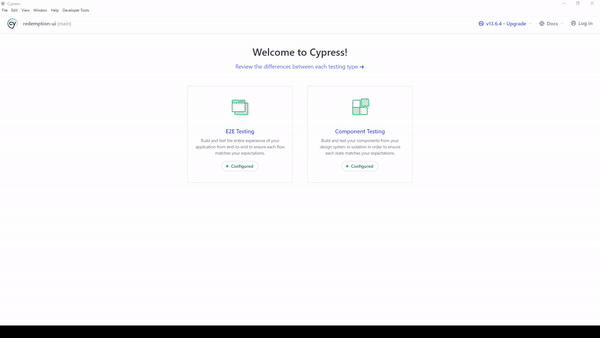

<p align="center">
  
</p>

# Redemption System
### This is a system built using React, NestJS and PostgresSQL for Govtech's take-home assignment.


<p align="center">
    
    
    
    
    
    
</p>

<p align="center">
    
    <h1 align="center"><a href="https://norbertloh.github.io/RedemptionUI/">Live Demo Here!</a>
    </h1>
    <p align="center">**Please Note**: This application is hosted on a free web service provider that may become idle after 15 seconds of inactivity. To ensure a smooth user experience, some redemption events have been pre-filled. If you don't see any events initially, please wait for about a minute for the server to restart. Thank you for your patience and understanding!</p>
    
</p>

# Web Service and Database Documentation can be seen [here](https://github.com/NorbertLoh/RedemptionAPI).

## Technologies Used
* **Frontend**: React single page application
* **UI**: Ant Design
* **Frontend Testing**: Cypress
* **Backend**: NestJS for REST API
* **Database**: PostgreSQL for data storage

## Assumptions
* Staff pass ID includes their position to be unique
* Staff pass ID will not be longer than 100 characters
* Team name will not be longer than 45 characters
* Event name will not be longer than 45 characters

## Motivation Behind the Design
Initially, I considered creating a simple program that reads the CSV and allows users to perform actions through the terminal and then write the redemption data in another CSV file. However, I decided that it would not be scalable as the program can only be used on the computer where the program is stored. Similarly, if the system is used during an event where many people might be redeeming things, we cannot have multiple redemption counters.

So I thought, what if I created an interface with React and stored the redemption data in Google Firebase / MongoDB? This brings up another issue where all the business logic will be stored in the React frontend. Storing application logic in the front-end is also unsafe as it exposes to potential attacks about the system and data model.

Therefore, I concluded that the best way to do this is to separate the client and server. Therefore, the client will only be in charge of serving the information in an interface to the user, and the server will handle all the business logic.

## Architecture
<p align="center">
    
</p>

### React
React was chosen for its ability to create Single Page Applications (SPAs), allowing for data and UI updates without full page reloads. TypeScript was used to handle all the API calls within each component.

### NestJS
I used NestJS during my internship GIC previously and absolutely fell in love with it. NestJS is built on top of express and provides a given structure and guidelines. Furthermore, since Typescript is a strongly typed programming language, NestJS was the perfect choice as it comes loaded with many safety features. One such feature is ensuring information recieved matches the type defined.

### PostgresSQL
Initially I started with MySQL as it was one of the more common databases. However, I wanted to host the website so that you will be able to interact with it without having to download everything. Since, I found a free provider that allows me to host my web service with their PostgresSQL for free, I decided to move to PostgresSQL.

## Set up
If you would like to run the client on your machine,
1. Clone the repository
2. Install the dependencies using `npm install`
3. Change `config.ts` accordingly
   
    ```TSX
    const config = {
        API_BASE_URL: "YOUR_API_BASE_URL",
        BASE_URL: "THIS_PROJECT_BASE_URL"
    };

    export default config;
    ```
4. Start the frontend application locally using `npm run start`

## Testing
Of course, no software will be complete without automated testing!
We can create AAA quality tests by following the AAA principle which is, Arrange-Act-Assert.

You can run Cypress and the e2e test by,
1. Running `npm run cypress:open` in the root directory
2. E2E Testing
3. Select the browser you want to run on
4. Select `spec.cy.ts` or any test you want to run

<p align="center">
    
</p>

You can write similar tests by following this example.
```TSX
describe("Test invalid staff file", () => {
  it("tests adding invalid staff", () => {
    // arrange
    cy.viewport(965, 748);
    cy.visit(config.BASE_URL);

    // act
    cy.get("#file").selectFile('../redemption-ui/cypress/wrong.csv', {force: true});
    
    // assert
    cy.get("span:nth-of-type(2)").should('have.text', 'Invalid Data!!');
  });
});
```

## Contribution
If you would like to add or build on top of this project, the important files are stored in the following file structure.
```
├── ...
├── cypress
│   └── e2e
│        └── spec.cy.ts
├── src
│   ├── pages
│   │   ├── MainPage.tsx
│   │   └── index.tsx
│   ├── index.js
│   ├── App.tsx
│   ├── config.ts
│   └── index.tsx   
└── ...
```

## Documentation
Documentation for technologies used can be found in the following links.
* [React](https://legacy.reactjs.org/docs/getting-started.html)
* [ANTD](https://ant.design/components/overview/)
* [NestJS](https://docs.nestjs.com/)
* [Cypress](https://www.cypress.io/)
* [Swagger](https://swagger.io/)
* [PostgresSQL](https://www.postgresql.org/docs/)
  
<p align="center">
  <br />
  <h1 align="center">Hi There! I'm Norbert! &#128075;</h1>
    <p align="center">
      
    </p>
    <p align="center">
      <a href="https://www.linkedin.com/in/lohnorbert/"></a>
      <a href="mailto:lohnorbert@gmail.com"></a>
      <a href="https://norbertloh.github.io/portfolio/"></a>
  </p>
  <p align="center">Thank you for taking your time to look through my project! Hope you enjoyed it as much as I did during the development of this project!</p>
  <p align="center">Feel free to contact me to discuss any issues, questions or comments.</p>
</p>


